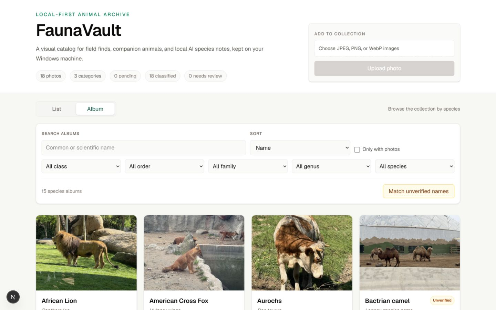

# FaunaVault

FaunaVault is a local-first animal photo archive. Originals and derived images stay on your computer, metadata lives in SQLite, and optional AI classification runs through local Ollama vision models. GBIF taxonomy lookup is the only network-backed product integration and degrades to locally cached taxonomy when unavailable.



## Features

- Interactive single- and multi-file upload with JPEG, PNG, and WebP content validation and a frontend-controlled sequential queue
- Exact duplicate detection using SHA-256, including duplicates currently in Trash
- Conservative perceptual near-duplicate review with an explicit Keep both choice
- Original, resized, and thumbnail variants with EXIF orientation handling
- Searchable/filterable photo catalog, species albums, animals, and GBIF taxonomy linking
- Durable SQLite-backed Ollama classification jobs with confidence-based review, provenance, retry, and manual metadata editing
- Recoverable Trash with restore and explicitly confirmed permanent deletion
- Versioned, backed-up SQLite migrations and local-only storage

## Interactive uploads

The catalog uploads a multi-file selection one file at a time and shows each
file's real state: `Waiting`, `Uploading`, `Uploaded`, `Exact duplicate`,
`Possible duplicate`, or `Failed` (`Cancelled` is shown after the user cancels
a possible-duplicate review). The display reports the active file's ordinal,
such as `Uploading 2 of 5`; it does not invent byte-level percentages because
the current request layer does not receive byte progress.

One file's validation, duplicate, network, or server outcome does not roll back
completed siblings or stop later queued files. A failed item can be retried in
place when the failure is transient (a network error or HTTP 5xx response),
without re-uploading completed files. Possible visual duplicates remain pending
for independent review after the initial queue has finished, so each can be
kept or cancelled without changing the other file outcomes.

Catalog refreshes are batched around those phases instead of running after every
successful file: once after the initial pass when it saved photos, and once
after the duplicate-review queue drains when `Keep both` saved additional
photos. A refresh failure is reported separately and does not relabel an
already accepted upload as failed. The backend's compatibility batch-upload API
remains available, but the interactive catalog uses the single-photo endpoint
to provide these per-file states and retries.

## Catalog API and navigation

The main List view uses `GET /catalog/photos`, a backend-paginated and
backend-filtered API with 48 items by default and a maximum page size of 100. It
supports `page`, `page_size`, `search`, `status`, `category`, `uncategorized`, `taxon_id`,
`sort`, and `order`. Responses include the filtered `total`, `total_pages`, and
small global status/category facets. Search is a case-insensitive SQLite
substring search across photo metadata, tags, animal names, and locally stored
taxonomy; whitespace-separated terms must all match somewhere in the record.

Verified taxon choices are loaded separately and in bounded pages from
`GET /catalog/taxa`. Each option uses the stable local `Taxon.id` and includes
its display label, scientific name, and active-photo count. The legacy
`GET /photos` endpoint remains unchanged and still returns the complete active
Photo array for compatible consumers.

List page, search, filters, sorting, verified taxon, and flat/grouped layout are
stored in URL search parameters. Refresh, copied URLs, browser Back/Forward,
and photo detail return navigation restore the same catalog context. Grouping
is intentionally page-local once pagination is active.

## Exact and possible visual duplicates

Byte-identical uploads are detected by SHA-256 and rejected with HTTP 409. This
authoritative rule also applies when the existing photo is in Trash and cannot
be bypassed.

After the SHA check, the backend calculates a local `phash64-v1` perceptual
fingerprint from EXIF-oriented, metadata-independent pixels and compares it with
active and Trash photos. A Hamming distance of four or less is treated only as
evidence of a possible visual duplicate. The upload is not finalized until the
user chooses `Keep both`; confirmation re-uploads and fully re-analyzes the file,
including a fresh exact check and candidate scan. Cancel leaves no server-side
staged file. Burst frames, crops, recoloring, and structurally similar photos can
produce warnings, while stronger edits may not be detected.

Schema migration 9 adds the nullable fingerprint field. Existing originals are
hashed by a resumable background task, one image at a time in batches of 25 with
a short pause between batches so API, upload, and classification work can
interleave. Missing or unreadable originals remain nullable and are reported by
photo ID; exact duplicate protection stays active throughout. Candidate previews
use an ID-based photo endpoint and do not expose perceptual hashes or storage
filenames.

## Architecture and storage

- Frontend: Next.js 16, React 19, TypeScript, Tailwind CSS
- Backend: FastAPI, Python 3.12+, SQLModel, SQLite, Pillow
- AI: local Ollama (`qwen3-vl:8b`, with `gemma4:e4b` fallback by default)

The default Windows configuration stores image files under `E:/FaunaVault/data/images` and SQLite metadata under `backend/data/faunavault.db`. Existing `.env` values take precedence; upgrades do not relocate data. Originals are preserved byte-for-byte. Resized and thumbnail files are reproducible derivatives.

Normal deletion only sets a deleted timestamp. Trash continues to reference the same local files. A photo must be moved to Trash before it can be permanently deleted. Permanent deletion stages variants in a private journal, commits the row deletion, and cleans the staged files; interrupted work is reconciled on the next backend startup.

## Local AI classification jobs

Classification requests are persisted in SQLite and processed serially by a lightweight worker inside the single FastAPI process. The browser does not need to stay open: queued and running state survives navigation and refresh, while completed and failed jobs remain visible with their model, duration, attempt count, and prompt version.

Jobs use `queued`, `running`, `succeeded`, and `failed` execution states. A succeeded result may still set the photo to `needs_review` when confidence is low or the model requests review; that is not an execution failure. Failed jobs require an explicit retry. Retry reuses the job, increments its attempt count, and refreshes `queued_at`, which is the FIFO queue-order timestamp.

The primary model runs first. The configured fallback runs once when the primary fails or produces low confidence; provenance identifies the actual accepted model. Connections time out after 10 seconds and classification requests after 120 seconds. Malformed model output and Ollama failures become safe failed jobs without overwriting photo metadata.

An unexpected backend stop marks any interrupted running job failed on restart with an explicit retry action; work is never silently repeated. Moving a photo to Trash fails queued/running work, and a delayed Ollama response cannot write metadata after Trash or a manual edit. Restoring the photo permits explicit retry but does not restart work automatically.

FaunaVault supports one local backend process and one classification worker. Do not run multiple Uvicorn workers; distributed worker coordination is deliberately out of scope.

The existing `POST /photos/{id}/classify` and `POST /photos/classify-pending` URLs are retained, but both now return asynchronous HTTP 202 job resources instead of synchronous Photo or batch-result bodies. There is no legacy synchronous Ollama classification route. The canonical resource API is `POST/GET /classification-jobs` plus `POST /classification-jobs/{id}/retry`.

## Developer commands

Install Python 3.12+, [uv](https://docs.astral.sh/uv/), Node.js 24+, and npm.
[Ollama](https://ollama.com/) is needed only for local AI classification. From
the repository root, the optional convenience commands are:

```powershell
python scripts/dev.py setup
python scripts/dev.py check
python scripts/dev.py check-clean
python scripts/dev.py backend
python scripts/dev.py frontend
```

`setup` runs `uv sync` for the backend and `npm ci` for the frontend. It does
not create environment files, install or start Ollama, or pull models. `check`
runs the backend and frontend validation stages against the installed
environment without synchronizing or reinstalling dependencies. Run `setup`
first if the backend virtual environment or frontend `node_modules` is missing.
`check-clean` performs the frozen backend sync and clean frontend install before
running the same validation stages, making it the CI-equivalent path. Both
checks are sequential and fail fast.

`setup` and `check-clean` run `npm ci`, which replaces `node_modules`. On
Windows, stop the Next.js development server before running either command so
loaded native `.node` modules are not locked. If an interrupted install leaves
the frontend dependencies incomplete, stop the server and rerun `python
scripts/dev.py setup`. If `node_modules` remains locked or corrupt, manual
cleanup of `frontend/node_modules` may be required before retrying setup.

Run `backend` and `frontend` in separate terminals; combined process
orchestration is deliberately omitted so Ctrl+C behavior stays predictable on
Windows and POSIX systems.

The commands resolve paths from the script location, so they can also be
invoked by absolute or relative script path from another working directory.
On macOS or Linux, use `python3` instead of `python` if that is how Python 3.12+
is exposed on `PATH`.

## Manual setup and development

The underlying uv and npm commands remain authoritative and can be run
directly. For the backend:

```powershell
cd backend
uv sync
uv run uvicorn app.main:app --reload --host 0.0.0.0 --port 8000
```

In a second terminal:

```powershell
cd frontend
npm ci
npm run dev
```

For local AI classification, install Ollama separately and pull the primary
model when needed:

```powershell
ollama pull qwen3-vl:8b
```

Open [http://localhost:3000](http://localhost:3000). Backend health is available at [http://localhost:8000/health](http://localhost:8000/health).

## Configuration

Copy `backend/.env.example` and `frontend/.env.local.example` to their non-example names as needed. Important backend values:

```env
DATA_DIR=E:/FaunaVault/data
IMAGE_DIR=E:/FaunaVault/data/images
DATABASE_URL=sqlite:///./data/faunavault.db
OLLAMA_BASE_URL=http://localhost:11434
AI_PRIMARY_MODEL=qwen3-vl:8b
AI_FALLBACK_MODEL=gemma4:e4b
AI_CONFIDENCE_THRESHOLD=0.65
MAX_UPLOAD_BYTES=52428800
MAX_IMAGE_PIXELS=80000000
```

Frontend:

```env
NEXT_PUBLIC_API_URL=http://localhost:8000
```

## Validation

From the repository root, `python scripts/dev.py check` runs routine validation
against the currently installed dependencies:

```powershell
cd backend
uv run --no-sync ruff check .
uv run --no-sync ruff format --check .
uv run --no-sync pytest

cd ../frontend
npm run lint
npm run typecheck
npm test
npm run build
```

`python scripts/dev.py check-clean` is the clean, reproducible validation path.
It runs `uv sync --frozen`, performs the backend commands above, runs `npm ci`,
and then performs the frontend commands above. This is semantically equivalent
to the dependency installation and validation sequence in GitHub Actions; the
subsequent backend commands use `--no-sync` so only the explicit frozen sync can
mutate dependencies. Stop the frontend development server first on Windows.
The manual subsystem commands remain useful for troubleshooting.

### Browser smoke coverage

The focused Playwright smoke suite is separate from routine pytest and
Vitest/JSDOM validation. It builds the production frontend with the test API URL,
starts that build with `next start`, launches the real FastAPI application, and
uses Chromium to exercise upload and duplicate refusal, catalog/detail metadata
editing, real backend image loading, and Trash restore/permanent deletion.

Install the Chromium runtime once after installing frontend dependencies:

```powershell
cd frontend
npx playwright install chromium
```

Then run the complete isolated workflow from `frontend`:

```powershell
npm run test:e2e
```

Each run creates a uniquely named `faunavault-e2e-*` directory under the OS
temporary directory and explicitly points SQLite and every image directory at
that location. It never copies or opens the configured archive, refuses to reuse
processes already listening on its dedicated ports (`3001` and `8001`), and
removes the temporary archive after success or failure. The selected workflow
does not classify photos or search taxonomy, so Ollama, GBIF, and network access
are not required. Browser installation and smoke coverage are deliberately not
part of `setup`, `check`, `check-clean`, or ordinary `npm test`.

## Portable metadata export

FaunaVault can export a deterministic, schema-versioned inventory of all Photo,
Animal, and locally stored Taxon metadata without copying media. JSON is the
authoritative representation; an optional flat Photo CSV is available for
spreadsheets and ordinary data-analysis tools. Both active and Trash Photos are
included, with portable original paths, actual streamed sizes, and SHA-256
values.

From `backend`, choose a new destination directory whose parent already exists:

```powershell
uv run faunavault-export E:\FaunaVaultExports\metadata-2026-08-20
uv run faunavault-export E:\FaunaVaultExports\metadata-2026-08-20-with-csv --csv
```

The command may run while the backend is online. It reads a coherent SQLite
snapshot and fails safely if a referenced original disappears or changes while
being inventoried. It never writes to the application database, calls Ollama or
GBIF, runs archive repair, or includes absolute source paths and credentials.
The destination must not already exist and is published only after every
artifact passes internal validation.

The directory contains `archive-metadata.json` and, with `--csv`, `photos.csv`.
JSON is UTF-8 with visible Unicode, explicit nulls, deterministic ID ordering,
canonical UTC timestamps, LF newlines, and no volatile generation timestamp.
For example:

```powershell
python -m json.tool E:\FaunaVaultExports\metadata-2026-08-20\archive-metadata.json
jq '.counts, .photos[0]' E:\FaunaVaultExports\metadata-2026-08-20\archive-metadata.json
```

The CSV uses a documented `\N` null marker and compact JSON arrays for tags. See
[metadata export format v1](docs/METADATA_EXPORT_FORMAT.md) for the complete
field, encoding, relationship, and compatibility contract.

This export is an inspectable metadata and audit artifact only. It contains no
image bytes, has no import/restore guarantee, and does **not** replace a verified
backup containing the SQLite database and complete image payload.

## Backup and recovery

FaunaVault creates self-contained, verified local backup directories. Backups are
deliberately **cold**: stop the backend and keep it stopped for the complete
`create` command. SQLite can provide an online database snapshot, but a separate
image upload or permanent-delete operation could otherwise produce a mixed-time
database and filesystem set.

From `backend`, pass an existing local destination directory:

```powershell
uv run faunavault-backup create E:\FaunaVaultBackups
uv run faunavault-backup verify E:\FaunaVaultBackups\faunavault-backup-20260812T151500.123456Z-1a2b3c4d
uv run faunavault-backup rehearse E:\FaunaVaultBackups\faunavault-backup-20260812T151500.123456Z-1a2b3c4d E:\FaunaVaultRehearsals\recent-backup
```

Creation validates the source archive, snapshots SQLite with its supported
backup API, copies files with streaming SHA-256 checksums, verifies the complete
temporary set, rechecks lifecycle state, and only then publishes it under a
unique name. It never overwrites an existing backup. Warnings such as excluded
orphan files do not make an otherwise recoverable backup invalid; missing or
changed owned files do.

Backup format version 1 is an uncompressed directory:

```text
faunavault-backup-<UTC timestamp>-<id>/
  manifest.json
  database/
    faunavault.db
  images/
    original/
    resized/
    thumbs/
```

The SQLite snapshot contains photos, animals, taxonomy, schema migrations, and
classification jobs. All referenced original, resized, and thumbnail files are
included for both active photos and Trash. Derived variants remain included so
each backup is complete and immediately usable, even though they can now be
regenerated from verified originals. Upload staging, purge journals, SQLite
sidecars, pre-migration database copies, environment files, credentials, caches,
dependencies, and build artifacts are excluded.
Non-empty `.staging` or `.purge` state blocks creation; let normal backend
startup reconcile an interrupted purge, stop the backend again, and retry.

`manifest.json` records only backup-relative payload paths, counts, schema and
format versions, and SHA-256 checksums. Normal backups omit absolute source
paths, and verification never needs the original machine or live FaunaVault
configuration. Checksums detect accidental corruption, not malicious rewriting
of both the payload and manifest. Unexpected regular files are warnings;
symlinks and junctions are rejected and never followed.

### Backup verification and restore rehearsal

`verify` is the fast, read-only integrity check. It proves that the backup
format is supported, the SQLite database matches the schema claimed by the
manifest, and every required payload is present and checksum-valid. It does not
copy files, run migrations, or access configured live storage.

`rehearse` proves that the same backup can be recovered by the current
FaunaVault version. The target must not exist and its parent must already be a
regular local directory. The command verifies the complete source first, copies
only into a uniquely named isolated staging directory beside the target, runs
the real storage initialization and migrations, recovers interrupted running
classification jobs without starting the worker, checks preserved metadata and
albums, and requires a healthy archive-doctor result before publishing the
target. There is no `--force` option.

The successful target is retained for inspection with this logical layout:

```text
<target>/
  data/
    faunavault.db
    faunavault.pre-taxonomy.bak
    faunavault.pre-migrate-*.db  # present when migrations were required
  images/
    original/
    resized/
    thumbs/
    .staging/
    .purge/
```

The pre-migration copies are an intentional consequence of exercising the real
startup path, so allow extra free space for large databases. Rehearsal never
changes `.env`, switches the application to the target, starts Ollama/GBIF, or
processes queued classification jobs. Delete the complete target manually when
it is no longer useful. Periodically rehearse a recent backup as part of the
manual disaster-recovery routine.

Backup container compatibility and database recovery compatibility are separate:

| Backup format | Database schema | Current support | Action |
| --- | ---: | --- | --- |
| v1 | 9 | Supported | Verify, then rehearse/migrate in isolated storage |
| Other | Any | Unsupported | Reject before target writes |
| v1 | Other | Not supported until explicitly tested | Reject before target writes |

Schema support is intentionally explicit rather than automatically following
the latest application schema. Before adding schema `N`, existing historical
fixtures must continue to verify and rehearse, migration from every retained
supported schema must pass, and support for `N` must be added with dedicated
tests. Removing recovery support requires an explicit documented decision;
FaunaVault does not promise indefinite support for every historical schema.

### Live archive health and derived-image repair

Archive-wide maintenance is also deliberately cold. Stop the backend and keep
it stopped for the entire command. From `backend`, inspect the configured live
SQLite database and image root with:

```powershell
uv run faunavault-maintenance doctor
uv run faunavault-maintenance repair-derived
uv run faunavault-maintenance repair-derived --apply
```

`doctor` is read-only. It checks SQLite integrity, foreign keys and migrations;
active and Trash inventory; safe filenames and lifecycle state; original
SHA-256, size, format, decodability and pixel limits; resized/thumbnail format
and dimensions; perceptual-hash format; and unowned files. It uses a temporary
SQLite snapshot and verifies that the live inventory did not change during the
scan. Ordinary orphan files and directories are warnings and are never deleted.

`repair-derived` performs the same inspection and defaults to a dry run. It
lists only missing or invalid resized/thumbnail files whose originals pass the
complete trust check. `--apply` is required to write anything. Each new variant
is generated with the upload pipeline's current EXIF, sizing, format and quality
semantics, validated beside its target, and atomically promoted on the same
filesystem. On Windows, a sharing or permission failure leaves the prior target
in place and is reported for retry. Healthy variants and their mtimes remain
untouched; active and Trash photos receive identical protection.

Maintenance never changes originals, SQLite rows, original checksums,
perceptual hashes, metadata, taxonomy, classification jobs, or Trash state. A
missing, corrupt, or checksum-mismatched original is not repairable by this tool;
recover it from a separately verified backup. Non-empty `.staging` or `.purge`
state blocks maintenance. Let normal startup reconcile purge state, stop the
backend again, and retry. Recognizable interrupted-maintenance temp files are
reported as warnings and ignored as repair sources.

Exit codes are stable for automation: `0` means the completed archive check is
healthy (warnings are allowed), `1` means errors or repairable defects remain,
and `2` means usage, configuration, or startup I/O prevented a reliable check.
An applied repair finishes with a complete doctor pass and reports success only
when no integrity or repairable findings remain.

### Safe manual production restore

Production replacement remains intentionally manual. `rehearse` never writes to
configured live storage, renames production directories, or selects a backup.
To recover manually:

1. Stop FaunaVault, verify the selected backup, and preferably complete a restore rehearsal with the current version. Do not continue if either check fails.
2. Preserve the current database and complete image root as a separately named fallback. Never overwrite the only current copy.
3. Prefer fresh, empty restore locations. Copy `database/faunavault.db` to the path selected by `DATABASE_URL` and copy the three directories under `images` to the root selected by `IMAGE_DIR`.
4. Update `backend/.env` for those locations. Restore paths do not need to match the machine on which the backup was created.
5. Do not copy staging, purge, sidecars, migration backups, or manifest warnings into runtime storage.
6. Start the backend so normal migrations and startup recovery run. A restored `running` classification job becomes failed for explicit retry; queued jobs retain normal queue behavior.
7. Inspect catalog and Trash counts, albums, and representative original/resized/thumbnail files.
8. For an end-to-end post-restore integrity check, stop the backend and create a new verified backup of the restored archive in another safe destination.
9. Retain the pre-restore fallback until recovery has been fully validated.

Backup creation does not provide scheduling, retention, compression, encryption,
incremental storage, cloud upload, or remote destinations.

Before schema upgrades, FaunaVault creates timestamped SQLite backups next to the active database. Domestic metadata normalization is schema migration 5, so it is recorded only after successful normalization and safely retried if startup is interrupted. These backups supplement but do not replace full archive backups.

## Troubleshooting

- Ollama unavailable: verify `ollama list` and `curl http://localhost:11434/api/tags`, then retry the failed job.
- Duplicate response: open the referenced catalog photo or use “View Trash” and restore the deleted copy.
- Image rejected: confirm extension, MIME type, actual format, file size, and pixel dimensions agree with configured limits.
- Possible visual duplicate: compare the previews and choose Keep both or Cancel upload; similarity is evidence, not proof of identity.
- Migration failure: keep the backend stopped and inspect the newest `*.pre-migrate-*.db` backup before retrying.

See [docs/IMPROVEMENT_PLAN.md](docs/IMPROVEMENT_PLAN.md) for the audit and prioritized remaining work.
