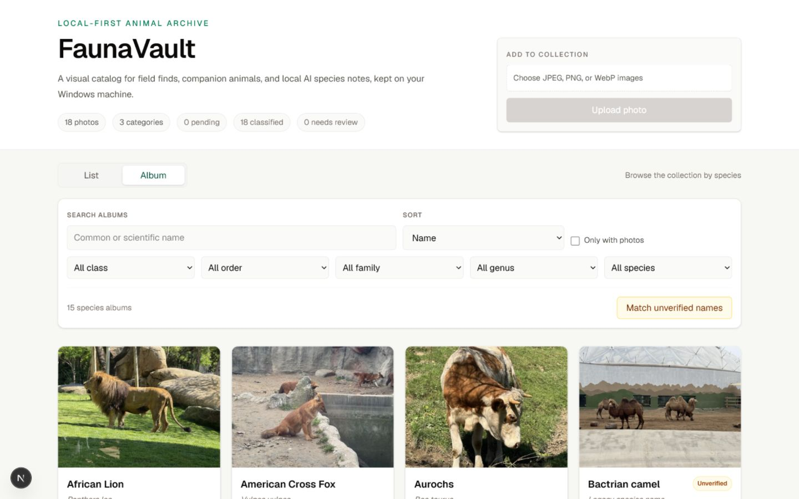

# FaunaVault

FaunaVault is a local-first animal photo archive for one person on one machine.
Original photos and previews stay on your filesystem, metadata lives in SQLite,
and optional AI classification runs through local Ollama vision models.

Current `master` is **v0.3.0.dev0** (unreleased development). The latest published
source-based release is **v0.2.0**. [Release notes](CHANGELOG.md) ·
[MIT license](LICENSE)



## Key features

- JPEG, PNG, WebP, HEIC, and HEIF uploads; recursive local folder import.
- Untouched originals, local previews, capture/camera metadata, and GPS extraction.
- Individual capture date/time, UTC offset, and GPS corrections, with retained
  extracted values and Restore original metadata. [Editing guide](docs/OPERATIONS.md#editable-capture-metadata-v02).
- Search, filters, sorting, Timeline, clustered Map, species Albums, manual
  Collections, and live Smart Collections.
- URL-restorable Map filters and compatible List navigation.
  [Map guide](docs/OPERATIONS.md#map-filters-and-list-navigation).
- Personal Favorites and 1–5-star Ratings, with List filters, rating sorting,
  Smart Collection criteria, and bulk actions. [Curation guide](docs/OPERATIONS.md#photo-favorites-and-ratings).
- Explicit cross-page selection for bulk tags, category, Collections, curation,
  and recoverable Trash.
- SHA-256 exact duplicate protection and conservative visual duplicate review.
- Duplicate Review Center for archive curation, persistent Keep both decisions,
  and recoverable Trash actions; explicit local scans discover existing pairs.
- Optional durable AI classification jobs, confidence-based Review Inbox,
  manual editing, and local taxonomy with GBIF lookup.
- Recoverable Trash, confirmed permanent deletion, archive diagnostics,
  verified cold backups, isolated recovery rehearsal, and portable metadata export.

## Requirements

Install [Python](https://www.python.org/downloads/) **3.12+**,
[uv](https://docs.astral.sh/uv/getting-started/installation/), and
[Node.js](https://nodejs.org/) **24+** with npm. Git is used to obtain/update the
source; it is not required by the running application. Dependencies include the
local HEIC/HEIF codec; no system codec is required.

[Ollama](https://ollama.com/) and a vision model are needed only for AI
classification. Browser tests additionally require Playwright Chromium.

## Quick Start

From PowerShell or a Unix-like shell:

```sh
git clone https://github.com/JureZajc/faunavault.git
cd faunavault
python scripts/dev.py setup
python scripts/dev.py doctor
```

Use `python3` instead of `python` on systems where it exposes Python 3.12+.
`setup` installs locked backend/frontend dependencies. It does not start services,
create environment files, initialize your archive, or download AI models.

No configuration is required for local defaults: SQLite at
`backend/data/faunavault.db`, images at `backend/data/images`, and the backend API
at `http://localhost:8000`. Missing storage before first startup is expected.
For custom paths, copy/edit `backend/.env.example` and
`frontend/.env.local.example` to their non-example names. Backend settings read
`backend/.env`; a root `.env` is not consumed. See
[configuration and upgrade safety](docs/OPERATIONS.md#configuration-and-initialization).

## Starting FaunaVault

Run these in two separate terminals from the repository root:

```sh
python scripts/dev.py backend
```

```sh
python scripts/dev.py frontend
```

Open [FaunaVault](http://localhost:3000). The backend listens on localhost and
initializes the database/directories and applies migrations on startup. Existing
archives are upgraded without a reset. [Health](http://localhost:8000/health)
reports status and application version. Stop each server with Ctrl+C.

For an existing archive using old implicit E-drive image storage, explicitly set
`IMAGE_DIR` to its existing root before upgrading. Startup refuses a populated
database paired with empty implicit portable originals; it never moves your data.

After stopping the backend, run `python scripts/dev.py doctor --archive` for a
full integrity scan. Plain `doctor` checks setup without scanning images or
contacting Ollama. [Diagnostics details](docs/OPERATIONS.md#setup-diagnostics).

## Importing an existing photo archive

Start the backend once to initialize/migrate storage, then stop it. From `backend`:

```powershell
uv run --no-sync faunavault-import "E:\Photos\Wildlife" --recursive --dry-run
uv run --no-sync faunavault-import "E:\Photos\Wildlife" --recursive
```

Unix example:

```sh
uv run --no-sync faunavault-import ~/Pictures/Wildlife --recursive --dry-run
uv run --no-sync faunavault-import ~/Pictures/Wildlife --recursive
```

Source files are never moved, renamed, or changed. Exact duplicates, including
Trash, are skipped; possible visual duplicates are skipped unless explicitly
allowed. Restart the backend after import. See
[all importer flags and queue behavior](docs/OPERATIONS.md#import-a-local-photo-folder).

## AI classification

Normal archive functionality works without AI. Ollama analyzes a local resized
preview to suggest animal metadata; its results can be edited or accepted in
Review. Primary and fallback both default to `qwen3-vl:8b`.

Install/start Ollama separately and explicitly install the model when wanted:

```sh
ollama pull qwen3-vl:8b
python scripts/dev.py doctor --ollama
```

An empty archive starts without contacting Ollama or downloading/warming models.
Previously queued classification jobs resume normal processing after restart.
Jobs persist in SQLite; execution failures have explicit Retry, and low-confidence
results enter Review. Folder import `--classify` queues newly imported photos
for processing after backend restart. See
[classification/retry details](docs/OPERATIONS.md#local-ai-classification-jobs)
and [Review Inbox](docs/OPERATIONS.md#ai-review-inbox).

## Backup and recovery

Stop the backend for backup creation and archive maintenance. From `backend`:

```powershell
uv run --no-sync faunavault-backup create "E:\FaunaVaultBackups"
uv run --no-sync faunavault-backup verify "E:\FaunaVaultBackups\<backup-name>"
uv run --no-sync faunavault-backup rehearse "E:\FaunaVaultBackups\<backup-name>" "E:\FaunaVaultRehearsals\new-target"
```

On Unix, substitute existing local directories such as `~/FaunaVaultBackups`.
Creation requires an existing destination; rehearsal requires a nonexistent
target with an existing parent. Backups include active photos, Trash, previews,
and SQLite metadata. Rehearsal migrates an isolated copy and requires a healthy
archive doctor; it never replaces your live archive. Backup format v1 supports
schemas 9–16. Production restore remains manual.

Read the [complete backup/recovery guide](docs/OPERATIONS.md#backup-and-recovery)
before relying on a backup. [Metadata export](docs/OPERATIONS.md#portable-metadata-export)
is separately useful for inspection and portability; it is not a recovery backup.

## Development and release validation

```sh
python scripts/dev.py check
```

This runs backend lint/format checks and pytest, frontend lint/typecheck/Vitest,
and a production build. It includes isolated first-run/schema and backup/recovery
coverage. `check-clean` performs frozen backend sync and `npm ci` first. Stop the
frontend before `setup`/`check-clean` on Windows because native modules may be locked.

For the release browser gate, from `frontend`:

```sh
npx playwright install chromium
npm run test:e2e
```

The suite uses a production build and real backend with disposable storage and
dedicated ports 3001/8001. It never uses your archive or requires Ollama, GBIF,
or OpenStreetMap. Dependencies/Chromium need installation access; the test
workflows themselves do not require external services. The smoke build uses its
own API URL, so restart/rebuild normal frontend development afterward.

## Documentation

- [Operations, configuration, import, AI, maintenance, and recovery](docs/OPERATIONS.md)
- [Backend architecture and commands](backend/README.md)
- [Frontend architecture and browser testing](frontend/README.md)
- [Metadata export format](docs/METADATA_EXPORT_FORMAT.md)
- [Measured catalog scale and R5 results](docs/CATALOG_BENCHMARK.md)
- [Engineering baseline and deferred work](docs/IMPROVEMENT_PLAN.md)
- [Maintainer release procedure](docs/RELEASE.md)
- [v0.2.0 release readiness and prepared GitHub notes](docs/RELEASE_READINESS_V0.2.0.md)
- [Historical v0.1.0 readiness report](docs/RELEASE_READINESS.md)

## Current limitations

- One user, one machine, one backend process and classification worker; local
  SQLite/filesystem storage, no authentication or cloud sync. Keep access local.
- GBIF taxonomy lookup uses the network; local taxonomy remains useful when it
  fails. OpenStreetMap basemap tiles are remote; photo records stay local and
  markers remain available without tiles. The basemap is not offline.
- No desktop installer, automatic update, automated production restore, or
  backup scheduling/retention/encryption.
- HEIC/HEIF uses the primary still image and 8-bit previews; no HDR/gain-map/color
  fidelity guarantee, container-frame browser, editing/re-encoding, or AVIF support.
- Metadata depends on valid source tags; capture time never substitutes import
  time. Possible visual duplicates are hints, not proof.
- Benchmarks tested synthetic metadata at 1k, 10k, 50k, and 100k photos. R5 improved
  browsing/count access, but substring search still scans candidates: rare search
  measured about 534 ms and the slowest text case about 758 ms at 100k. These are
  warm-cache service timings on one machine, excluding browser rendering, image
  loading, and HTTP transport—not universal scale guarantees. See the benchmark guide.

The project uses the MIT license. The committed HEIC compatibility fixture
retains its [BSD-3-Clause notice](backend/tests/fixtures/heic/LICENSE.txt).
